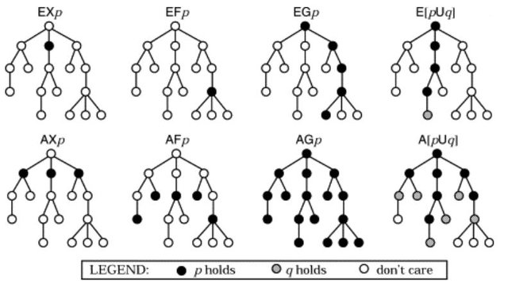

# Integration to Imandra

This folder contains plugins for the mapping of high-level Gamma (composite) models into IML through a symbolic transition systems formalism (xSTS). The plugins provide support for the integration of Gamma and Imandra, that is, the mapping of Gamma models into IML, mapping LTL properties to Imandra verify (or instance) calls, and using Imandra instances hosted in the cloud to carry out verification via Imandra's Python API.

## Setup

1. Set up an Eclipse with the [core Gamma plugins](../README.md).
2. Set up [Imandra](https://imandra.ai/). For this, you will need Python 3:
	- Open a command line and use *pip3* to install *Imandra*: `pip install imandra`.
	- Install the [imandra-cli](https://docs.imandra.ai/imandra-docs/notebooks/installation-simple/) client according to your operating system(i.e., `sh <(curl -s "https://storage.googleapis.com/imandra-do/install.sh")` or `(Invoke-WebRequest https://storage.googleapis.com/imandra-do/install.ps1).Content | powershell -`). Create an account using the *imandra-cli* and agree to the community guidelines, i.e., use the following command in a command line after navigating into the home folder of the installed *imandra-cli*: `imandra-cli auth login`.
	- Add the folder containing the *imandra-cli* to your systems's `PATH` environment or default search path (depending on your OS) - this is needed for the manual stopping (killing) of Imandra instances in the cloud environment.
3. Set up the plugins in this folder.
   - Import all Eclipse projects from this `iml` folder.
   
## Property specification

Gamma supports the specification of [computation tree logic*](https://en.wikipedia.org/wiki/CTL*) (CTL*) properties in the Gamma Property Language (GPL). CTL* can be considered as a superset of [linear-time temporal logic](https://en.wikipedia.org/wiki/Linear_temporal_logic) (LTL) and [computation tree logic](https://en.wikipedia.org/wiki/Computation_tree_logic) (CTL); two temporal logics that are incomparable, i.e., there are properties that can be expressed in one, but not the other. Nevertheless, note that LTL and CTL are the subsets generally supported by verification back-ends due to their decreased complexity.

### Linear-time temporal logic (LTL)

In logic, **linear-time temporal logic** (LTL) is a modal temporal logic with modalities referring to time. LTL allows for encoding formulas about *infinite paths* with respect to the behavior of a model, e.g., a condition will eventually be true or a condition will be true until another fact becomes true, etc. In contrast to other kinds of temporal logics, in LTL, we consider infinite *linear* paths (i.e., every path starting from the initial state of our model) without any possible branching later; hence the name LTL.

Syntactically, LTL formulas are composed of

1. a finite set of atomic propositions (AP) e.g., in the context of statecharts, references to variables, events and states, as well as the _true_ and _false_ boolean literals,
1. the logical operators ¬ and ∨, as well as
1. the unary temporal operators **X**, **F** and **G**, and binary temporal operator **U**.

The informal semantics of these temporal logic operators considering valid LTL (sub)formulas ψ and φ is as follows (note the visualization of paths where the LTL formula using the specific temporal operator holds):

- **X** φ: *neXt* - φ has to hold in the next state: 
- **F** φ: *Future* - φ eventually has to hold (somewhere on the subsequent path): 
- **G** φ: *Globally* - φ has to hold on the entire subsequent path: 
- ψ **U** φ: *Until* - ψ has to hold at least until φ becomes true, which must hold in the current or a future state: 
	- Note that **F** φ ≡ _true_ **U** φ, and **F** φ ≡ ¬**G** ¬φ. Moreover, ψ **R** φ ≡ ¬(¬ψ **U** ¬φ), ψ **WU** φ ≡ ψ **U** φ || **G** ψ and ψ **SR** φ ≡ ¬(¬ψ **WU** ¬φ).

### Computation tree logic (CTL)

__Computation tree logic__ (CTL) is a branching-time logic, i.e., its model of time is a tree-like structure with branchings (called the *computation tree*) in which the future is not determined; there are different paths in the future, any of which may be an actual path to be realized.

Syntactically, CTL formulas (just like in LTL) are composed of

1. a finite set of atomic propositions (AP) e.g., in the context of statecharts, references to variables, events and states, as well as the _true_ and _false_ boolean literals,
1. the logical operators ¬ and ∨, as well as
1. the unary path-specific temporal operators **X**, **F** and **G**, and binary path-specific temporal operator **U**.
1. In addition to LTL, CTL proposes quantifiers over paths: **E** (existential) and **A** (universal).

The informal semantics of the above-mentioned path-specific temporal logic operators is the same as for LTL; the difference is that CTL supports the **A** and **E** quantifiers that can be interpreted in every state during the execution of the model of interest and quantify the paths starting from these particular states. In contrast, LTL implicitly quantifies _universally_ over paths starting from the initial state (implicit **A** quantifier at the beginning of a formula specification).

In CTL, the quantifiers over paths (**A** and **E**) and the path-specific temporal operators (**X**, **F**, **G** and **U**) are grouped in pairs: one quantifier followed by a temporal operator, for instance, **AG**. In contrast, CTL* supports the free mixing of quantifiers and temporal operators (recall the (real) subset relation between CTL and CTL*). The semantics of CTL operators are depicted as follows.

### Mapping GPL properties into IML

The Gamma-IML integration supports the mapping of a subset of LTL properties specified in GPL. The mapping exploits the characteristics of the derived IML models, i.e., that the behavior is captured using three functions:

- *init*: the *init* function returns the initial state of the model;
- *run_cycle r e*: the *run_cycle* function executes the model a single time (single cycle/step), based on its current state (captured by _r_) and the single incoming input (_e_);
- _run r e list_: the _run_ function, in a **recursive** manner, calls the *run_cycle* method based on the initial model state (captured by _r_) and a list of incoming inputs (_e list_) zero or more times (size of _e list_).

Accordingly, the following LTL properties (using a valid nested LTL (sub)formulas ψ and φ and considering **universally** quantified paths) can be mapped into IML as follows:

- *X φ* ≡ *verify(fun e -> let r = run_cycle init e in φ)*;
- *G φ* ≡ *verify(fun e -> let r = run init e in φ)*;
- *F φ* ≡ *verify(fun e -> (ends_in_real_loop init e) ==> exists_real_prefix init e (fun r -> φ))* (i.e., for the last state in each path ending in a loop, there exists a preceding state where φ holds);
- *ψ R φ* ≡ *verify(fun e -> let r = run init e in φ || exists_prefix init e (fun r -> ψ && φ)* (i.e., φ holds in every state (globally), or there exists a previous state where both ψ and φ hold);
- *ψ WU φ* ≡ *verify(fun e -> let r = run init e in ψ || exists_prefix init e (fun r -> φ)* (i.e., ψ holds in every state (globally), or there exists a previous state where φ holds).

Limitation:

- *ψ U φ* ≡ *verify(fun e -> (ends_in_real_loop init e) ==> exists_real_prefix init e (fun r -> φ && forall_real_prefix init ?e_? (fun r -> ψ)))* (i.e., for the last state in each path ending in a loop, there exists a preceding state where φ holds, in each preceding state of which ψ holds - we cannot capture the last *e* input);
- *ψ SR φ* - cannot be supported similarly to the above reason.

Note that in case of a property violation based on the F and U operators (if the latter could be supported), we do not back-annotate the states "after" these temporal operators (i.e., we just return the loop, regardless of how the property was violated inside).

For **existentially** quantified paths, we can use the following mappings:

- *X φ* ≡ *instance(fun e -> let r = run_cycle init e in φ)*;
- *F φ* ≡ *instance(fun e -> let r = run init e in φ)*;
- *G φ* ≡ *instance(fun e -> (ends_in_real_loop r e) ==> forall_real_prefix init e (fun r -> φ))*;
- *ψ U φ*  ≡ *instance(fun e -> let r = run init e in φ && forall_real_prefix init e (fun r -> ψ))*;
- *ψ SR φ*  ≡ *instance(fun e -> let r = run init e in (ψ && φ) && forall_real_prefix init e (fun r -> φ))*.
